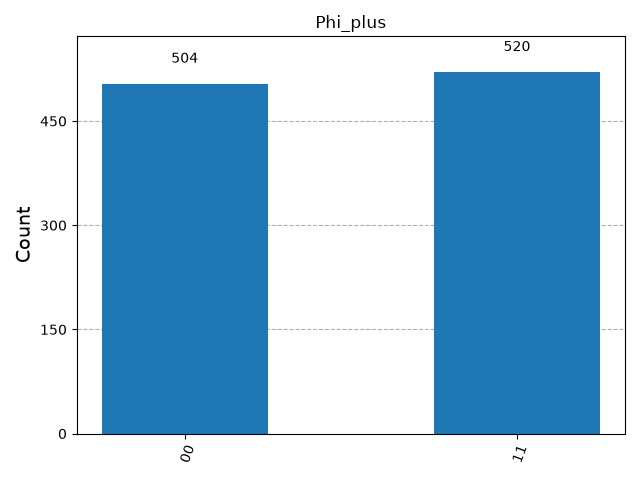

# Week 1: Bell State Verification ⚛️

A quantum computing project implementing and verifying the four fundamental **Bell States** (maximally entangled two-qubit quantum states) using **Qiskit** and **Qiskit Aer Simulator**.

---

## 📌 Overview

Quantum entanglement is a foundational principle of quantum information theory. This project demonstrates how to construct, simulate, and measure all four Bell states:
- $|\Phi^+\rangle = \frac{1}{\sqrt{2}}(|00\rangle + |11\rangle)$
- $|\Phi^-\rangle = \frac{1}{\sqrt{2}}(|00\rangle - |11\rangle)$
- $|\Psi^+\rangle = \frac{1}{\sqrt{2}}(|01\rangle + |10\rangle)$
- $|\Psi^-\rangle = \frac{1}{\sqrt{2}}(|01\rangle - |10\rangle)$

Using single-qubit logic gates ($H$, $X$) and the two-qubit entangling gate ($CNOT$), independent qubits are transformed into entangled states and simulated over 1,024 shots with `AerSimulator`.

---

## 🔬 Quantum Circuits & Math Formulations

| Bell State | Mathematical Formula | Quantum Gate Operations | Measurement Correlation |
| :--- | :--- | :--- | :--- |
| **$\Phi^+$** | $\frac{1}{\sqrt{2}}(|00\rangle + |11\rangle)$ | $H(q_0) \rightarrow CNOT(q_0, q_1)$ | Correlated ($\sim 50\% \: 00, \sim 50\% \: 11$) |
| **$\Phi^-$** | $\frac{1}{\sqrt{2}}(|00\rangle - |11\rangle)$ | $X(q_0) \rightarrow H(q_0) \rightarrow CNOT(q_0, q_1)$ | Correlated ($\sim 50\% \: 00, \sim 50\% \: 11$) |
| **$\Psi^+$** | $\frac{1}{\sqrt{2}}(|01\rangle + |10\rangle)$ | $X(q_1) \rightarrow H(q_0) \rightarrow CNOT(q_0, q_1)$ | Anti-correlated ($\sim 50\% \: 01, \sim 50\% \: 10$) |
| **$\Psi^-$** | $\frac{1}{\sqrt{2}}(|01\rangle - |10\rangle)$ | $X(q_0) \rightarrow X(q_1) \rightarrow H(q_0) \rightarrow CNOT(q_0, q_1)$ | Anti-correlated ($\sim 50\% \: 01, \sim 50\% \: 10$) |

---

## 📁 Repository Structure

```text
├── Bell_State_Verifictaion.py   # Main Python script constructing & simulating circuits
├── Figure_1.png                 # Histogram result plot for Phi_plus
├── Figure_2.png                 # Histogram result plot for Phi_minus
├── Figure_3.png                 # Histogram result plot for Psi_plus
├── Figure_4.png                 # Histogram result plot for Psi_minus
├── .gitignore                   # Ignored files (virtual environment, cache)
└── README.md                    # Project documentation
```

---

## ⚡ Setup & Execution Instructions

### Prerequisites
Make sure Python 3.9+ is installed along with the required libraries:

```bash
pip install qiskit qiskit-aer matplotlib
```

### Running the Verification Script

Run the verification script using Python:

```bash
python Bell_State_Verifictaion.py
```

---

## 📊 Results & Histograms

The simulation runs 1,024 shots per circuit on the `AerSimulator`. The histograms confirm the theoretical quantum state measurement distributions:

- **$\Phi^+$ & $\Phi^-$**: Produce output states $|00\rangle$ and $|11\rangle$ with equal probability ($\approx 50\%$ each).
- **$\Psi^+$ & $\Psi^-$**: Produce output states $|01\rangle$ and $|10\rangle$ with equal probability ($\approx 50\%$ each).



---

## 📜 License

This project is part of the **Quantum AI Labs Portfolio** (Week 1).
